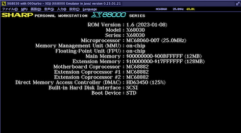
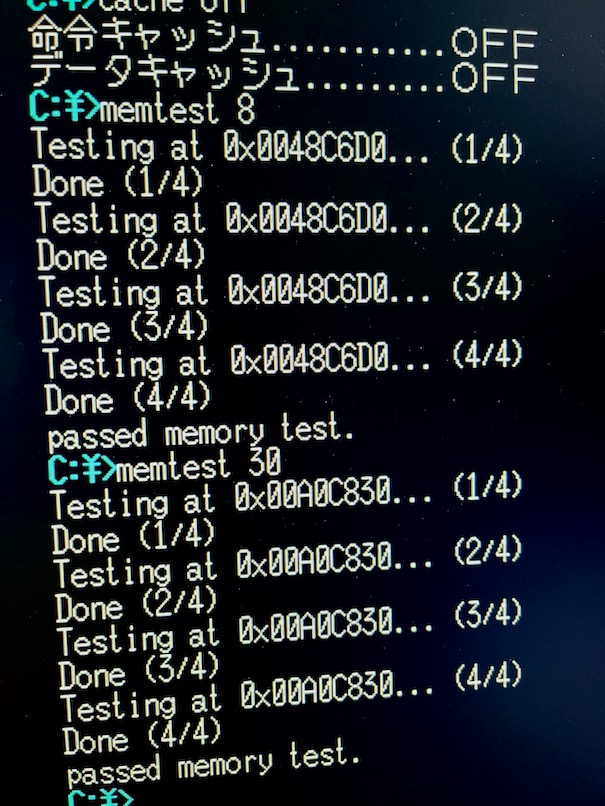

# X68030+060turbo との付き合い始め

## 目次

* [憧れのX68030](#%E6%86%A7%E3%82%8C%E3%81%AE-x68030)
* [060turboでもう一段上を](#060turbo-%E3%81%A7%E3%82%82%E3%81%86%E4%B8%80%E6%AE%B5%E4%B8%8A%E3%82%92)
* [何かがおかしい](#%E4%BD%95%E3%81%8B%E3%81%8C%E3%81%8A%E3%81%8B%E3%81%97%E3%81%84)
* [新品増設メモリ調達](#%E6%96%B0%E5%93%81%E5%A2%97%E8%A8%AD%E3%83%A1%E3%83%A2%E3%83%AA%E8%AA%BF%E9%81%94)
* [これで勝ったと思うなよ](#%E3%81%93%E3%82%8C%E3%81%A7%E5%8B%9D%E3%81%A3%E3%81%9F%E3%81%A8%E6%80%9D%E3%81%86%E3%81%AA%E3%82%88)
* [YUKIちゃんに手を出す](#yuki%E3%81%A1%E3%82%83%E3%82%93%E3%81%AB%E6%89%8B%E3%82%92%E5%87%BA%E3%81%99)
* [68060で常用できるのか](#68060%E3%81%A7%E5%B8%B8%E7%94%A8%E3%81%A7%E3%81%8D%E3%82%8B%E3%81%AE%E3%81%8B)
* [68LC060故の考慮点](#68lc060%E6%95%85%E3%81%AE%E8%80%83%E6%85%AE%E7%82%B9)

---

## 憧れの X68030

自分が30年ほど前にX68000XVIを所有していた時はまだ学生で、せいぜいバイトしてMIDI機器のSC-55や68030アクセラレータXellent30を買うのが精一杯。
憧れの赤バッジX68030は文字通り高値の華でした。さらにX68030のMPUを68040に載せ替えるアクセラレータ040turboも登場し、垂涎の眼差しでパソコン通信のログを眺めていたものです。

2023年現在、X680x0最強のMPUアクセラレータといえば、000機用の[Phantom-X](http://retropc.net/gimons/phantomx/)なのであろうと思います。
ある意味で Software Defined Accelerator と呼んでもいいくらい、ソフトウェアの力を存分に活用した素晴らしい設計です。

しかしながらどうしてもX68030に拘りたかった自分は、今回実機を探すにあたり、000機は最初から候補に入れませんでした。

---

## 060turbo でもう一段上を

なんとなくですが、クロックアップXVI+Xellent30の構成で長く使っていた経験から、X68030そのものへの憧れはともかくとして、X68030ノーマル25MHzのパフォーマンスはだいたいこれくらい、というイメージはありました。また、高速なX68エミュレータを最近ガッツリと使っていたこともあり、やはりノーマル030では物足りなくなるだろうな、ということだけははっきりしていました。

じゃあ040turboか060turboか、いずれかのアクセラレータもやはり何とかして導入したくなります。なお、それ以外にも何種類か030用アクセラレータは存在したようなのですが、自分はX680x0から離れていた時期も長く、詳しくはわかりません。

Mac上で使っているX68エミュレータでは060turboモードを常用しています。それではっきり分かったのはローカルメモリの有用性です。たとえばローカルメモリが128MBあれば、本体内蔵メモリ12MBの10倍以上の容量となり、特に実機においては本体メモリよりも極めて高速にアクセスできます。ちょこちょことコードを書くのが好きな自分にとっては大変魅力的な要素の一つでした。もちろん市中のソフトでローカルメモリにネイティブ対応したものは一部のフリーソフトくらいしかなく、ハイメモリローダを併用して動かすなどの対応が必要になります。

040turboと060turboの両者の違いとして決定的なのがこのローカルメモリの有無です。いや、もしかするとローカルメモリ対応の040turbo(相当)というのもあったのかもしれませんが、すみませんそちらも詳しくは知りません。040turboについては設計者のBEEPsさんの書籍を購入させて頂いて、そこで得た情報が自分の中のベースとなっています。今でも書籍は大事に持っています。

ローカルメモリの次に重視したのがMPUそのものの違いということになります。ただこれは実際に060turboを使い始めてみて感じたことですが、68060、速いですね。。。なんとなくのイメージに過ぎませんが、68040と68030の差より、68060と68040の差の方が大きい気がします。

そんな経緯もあって我が家の X68030 には 060turbo (満開版) も載っています。

---

## 何かがおかしい

とりあえず切り替えスイッチで68030モードと68060モードを切り替えて使ってみると内蔵フラッシュメモリ(HDDから交換済)からのHuman68kの起動はできます。ネットで時々見かけるテキスト化けなども全くありません。

ただ、エミュレータ上で作っていた自作のアプリケーションを色々と動かしてみると何かがおかしいのに気づきました。メモリが全然確保できないのです。68060モードでのハイメモリの確保は問題ないのですが、メインメモリの方がさっぱりです。

メインボードをよく眺めてみると、サードパーティの030専用増設8MBメモリが装着されています。起動時のIPL画面でも12MBと表示されます。でもメインメモリから全然MALLOCできません。

そしてようやく気がつきました。Human68k は `SWITCH.X` というコントロールパネル的な標準コマンドで、内蔵メモリ容量を自由に設定できるのでした。物理的にメモリを装着すると自動ですぐに使えるようになるわけではなく、必ずこの `SWITCH.X` での容量設定が必要になります。確かこの設定はSRAMに記録されたはずです。その設定をよく見てみると `4096KB (4MB)` という設定になっており、メインボード直付けの4MBのみ使用する設定になっていました。

ははぁ、これが理由なのかと納得し、早速フルの12MB設定にして再起動してみます。すると68030モードであっても動作が極めて怪しくなりました。Humanはどうにか起動しますが、ちょっと何かの拍子に白窓の嵐... ということでこの時点での推測は、「**この増設メモリは故障している。そのため以前のオーナーの誰かが強制的に内蔵メモリだけを使うようにSWITCH.Xで制限した。**」でした。増設メモリは取り外すことにしました。

取り外された I/O-DATA X68030専用8MB増設メモリ SH-5BE4-8M

---

## 新品増設メモリ調達

メモリモジュールの故障となると、こればっかりは交換するしかありません。しかしX68030専用の内蔵メモリなど、そう簡単に手に入るはずが...

と思ってたらあっという間に手に入ってしまいました。しかも最新設計かつ新品です！！

これは[えくしみえむさんが設計されたX680x0シリーズ用増設メモリボード](http://www.katch.ne.jp/~x680x0_mania/xm5be8.html)の一つで、秋葉原のBEEPさん専売となっています。BEEPさんのインターネット通販では売り切れとなっていたのですが、実店舗を訪れたところなんと店頭在庫が！1も2もなくすぐに購入させて頂きました。

えくしみえむさんのサイトをご覧になると分かりますが、とにかくデザインが美しいです。よくあるメモリボードの無骨なイメージとは違って、基板カラーも含めて非常に魅力あるプロダクトデザインでワクワクしてきます。

---

## これで勝ったと思うなよ

早速取り付けを済ませ、まずは認識されていることを確認。`SWITCH.X` での設定も行います。

次に68030モード・キャッシュオフにして自作の簡単なメモリチェッカを走らせてみました。

えーっ...

書いたワード値を読み出すだけですが、見事に化け化けです。

最新設計・新品のメモリモジュールで故障というのは考えづらい...と、ここに至って思い出したのが040turbo開発本や、かつてのバッ活(ゲームラボ)に書かれていた030の**スタティックカラムモード**の設定の件。クロックアップしたマシンではこれをOFFにしないとメモリアクセスに失敗するという話がありました。ノーマルX68030はメモリアクセスの効率を上げるためにこのスタティックカラムモードがデフォルトで有効化されています。

040turbo開発本でも当初はこのスタティックカラムモードをOFFにしないと、040turboのドータカードで延長されたメモリバス経由ではうまく動作しなかったと記載されています。

定格動作の060turboでスタティックカラムモードをOFFにするような推奨があったのかどうかは知り得ませんが、どうも我が家の機体では、**メインボード標準4MBメモリについては060turbo経由でのスタティックカラムモードアクセスには問題が出ないものの、増設8MB部分についてはスタティックカラムモードは無理**ということなのではないか、と判断しました。なお、この機体はクロックアップはされておらず、68030は25MHz、68060は50MHz動作です。

---

## YUKIちゃんに手を出す

最悪内蔵4MBメモリ＋060モードのハイメモリ128MBで頑張るという手もあったのですが、ダメ元でやってみることにしました。スタティックカラムモードをOFFにする改造です。

クロックアップ改造のようにオシレータを外したりとか、そこまで大変な作業ではなく、メモリコントローラYUKIの近くにある**SW1**にジャンパ線を飛ばすだけです。昔取り組んだXVIのクロックアップ改造やら万能リモコン製作やらの経験を生かさない手はないです。

とはいえ、すっかり老眼となった自分にはこの細かさ... ホームセンターで「表面実装電子部品用」の小出力かつ先の尖ったハンダゴテを新調して臨み、どうにかジャンパ線を飛ばすことができました。

ドキドキしながら68030モードで起動して再びメモリチェック。

今度は増設した 0x400000 - 0xBFFFFF までどの区画もバッチリです！

68060モードも同様です。そもそもスタカラONにして12MB設定にすると060turbo.sysがハングアップして68060モードでは起動すらできませんでしたが、スタカラOFFだと全く問題ありません。

これでダメだった場合は拡張I/Oスロットに挿すメモリボードも考えました。アクセスが遅いのでそれはきっと大丈夫なはず、と。でも無事に内蔵メモリだけでフル実装の12MBが使えるようになって本当に良かったです。実際のところスタカラONとOFFでそこまで体感できるような差はみられません。

---

## 68060で常用できるのか

スタティックカラムモードをOFFにしてからは、基本的にずっと68060モードで使っています。エミュレータでも常時68060モードですし、もともとあまりゲームはしない自分にとっては互換性云々で困ることはありません。たまに市販ゲームやMOに残しておいた同人ゲームをやろうとすると68060というよりは68030の時点で苦労しますが...。ある程度は昔の電脳倶楽部に030パッチが掲載されていました。MOに色々と残しておいて良かったです。あ、令和版Ys3は68060で全く問題ありません！エンディングまで68060通しでいけました！

これを書いているのは2月、気温は低いです。夜はエアコンの暖房を入れる部屋でX68030の外側カバーは閉めた状態で使っています。68060にはヒートシンクのみでファンはありません。

長く使っていて起動後数時間が経過すると「アドレスエラー」の白窓や、そこからリセットしての「ディスクから起動できません」の白窓が出ることもあります... この時点で本体カバーは触るとまあまあホカホカです。

冬でこんな調子なので夏が心配ではあるのですが、とりあえず自分的には常用できると言って問題ないレベルかなと。飛ばすとマズいコードやデータなどはもっぱらクロスコンパイルするMac側にありますしクラウドでバックアップもされています。多少ハングアップしても、今のところは笑って許せる範囲内です。

https://user-images.githubusercontent.com/121137457/215325813-f0d3b2cc-ab59-48f8-b1fe-951dca339fa2.mp4

X68030 + 060turbo + ローカルメモリ 実機と[GIFEX.X](https://github.com/tantanGH/gifex)でのアニメーションGIF動画再生例
(画面モード384x256x65536色, 元データ300x212x8bitパレット, 30fps, C言語のみ)

---

## 68LC060故の考慮点

68060MPUにはいくつか種類があります。

- MC68060 ... フルスペック (FPU,MMUあり)
- MC68LC060 ... FPUなし, MMUあり
- MC68EC060 ... FPUなし, MMUなし

我が家の68060はLC版(Rev4,66MHz版)です。つまりFPU(浮動小数点演算コプロセッサ部)が存在しません。X68030メインボード上には68882が装着されているのですが、これは68030モードの時にしか有効になりません。このため、CONFIG.SYS には FLOAT4.X -> FLOAT2.X の順で両方エントリを用意してあります。

こうすることで、68030モードで起動した時にはFLOAT4+68882で、68060モードで起動した時にはFLOAT2での整数演算エミュレーションでそれぞれ浮動小数点演算(FEコール)が実行されることになります。

68060の能力を目一杯使うために、gcc (xdev68k) で68060専用の最適化を施したい時があります。この時単純に `-m68060` だけつけて68060用コードを生成すると、浮動小数点演算命令ありのコードが出力されてしまいます。フルスペックの68060ならこれで問題ありませんが、うちのLC版ではそれらのコードを実行しようとするとハングアップしてしまいます。

これを防ぐには、`-msoft-float` も合わせて gcc のオプションに加えてやることで、68LC060でも問題なく動作するコードを生成することができます。逆に言えばフルスペックの68060向けの最適化では無くなってしまうのですが。

---

## 更新履歴

2023.2.4 ... FPU関連追加
2023.2.1 ... 初版
