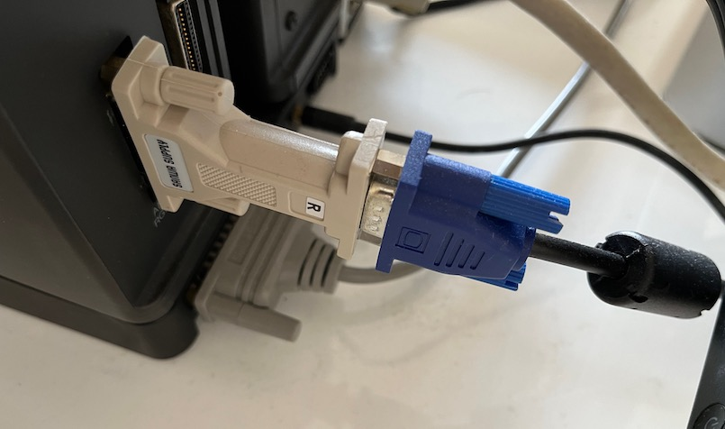
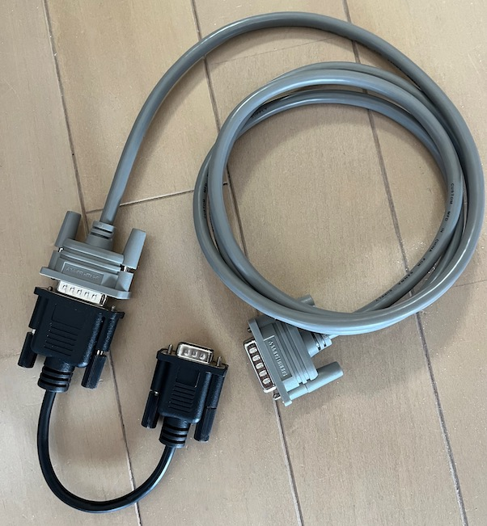
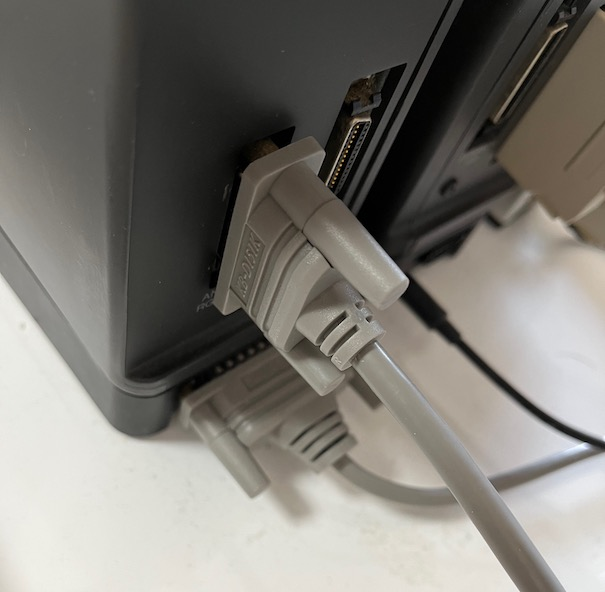
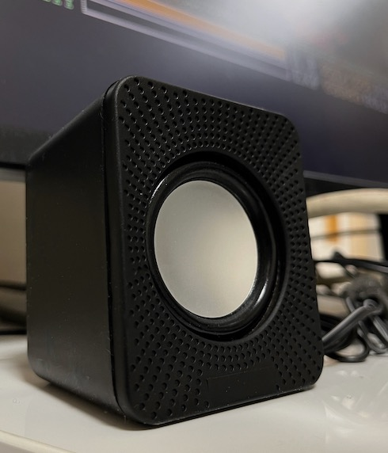
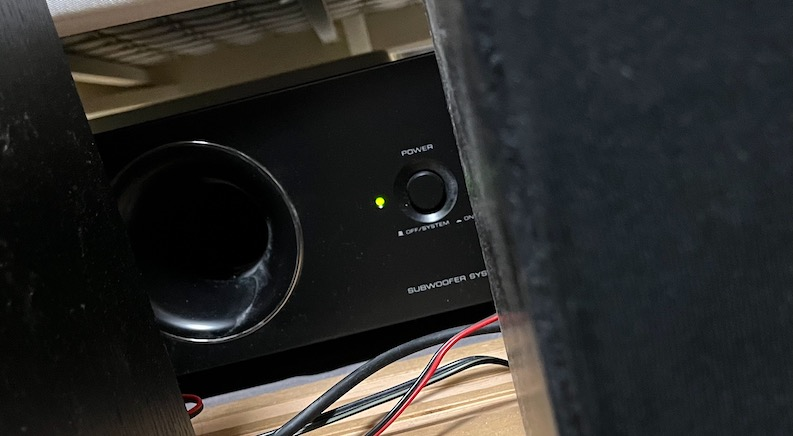
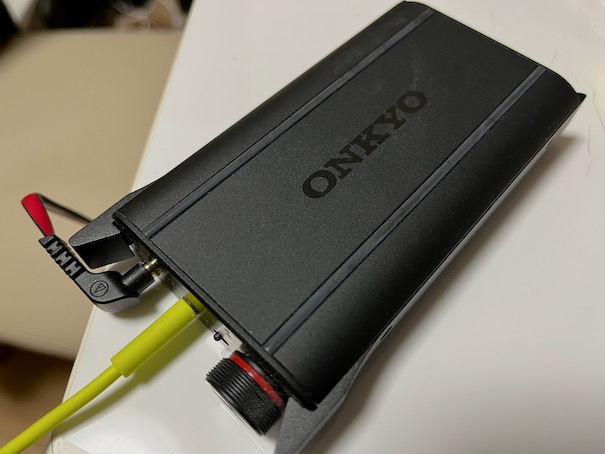
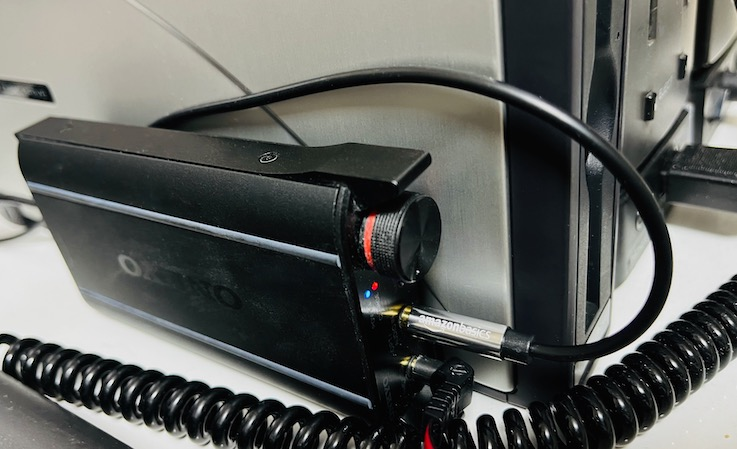
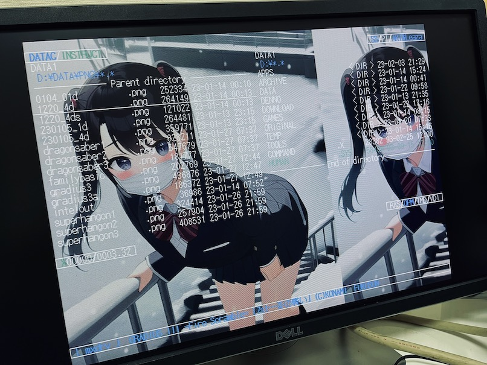
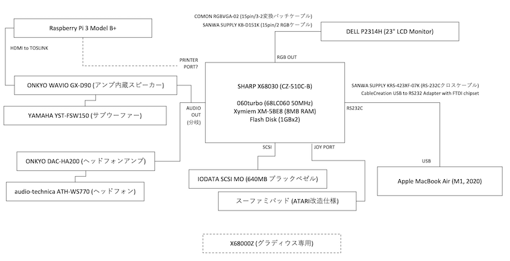

# X68030+060turbo との付き合い始め (周辺機器編)

## 目次

* [RS232C-USBクロスケーブルでのMacとのファイル交換](#rs232c---usb-%E3%82%AF%E3%83%AD%E3%82%B9%E3%82%B1%E3%83%BC%E3%83%96%E3%83%AB%E3%82%92%E4%BD%BF%E3%81%A3%E3%81%9F-mac-%E3%81%A8%E3%81%AE%E3%83%95%E3%82%A1%E3%82%A4%E3%83%AB%E4%BA%A4%E6%8F%9B)
* [RGBケーブルおよびコネクタの交換](#rgb%E3%82%B1%E3%83%BC%E3%83%96%E3%83%AB%E3%81%8A%E3%82%88%E3%81%B3%E3%82%B3%E3%83%8D%E3%82%AF%E3%82%BF%E3%81%AE%E4%BA%A4%E6%8F%9B)
* [サブウーファー投入](#%E3%82%B5%E3%83%96%E3%82%A6%E3%83%BC%E3%83%95%E3%82%A1%E3%83%BC%E6%8A%95%E5%85%A5)
* [ポータブルヘッドフォンアンプの導入](#%E3%83%9D%E3%83%BC%E3%82%BF%E3%83%96%E3%83%AB%E3%83%98%E3%83%83%E3%83%89%E3%83%95%E3%82%A9%E3%83%B3%E3%82%A2%E3%83%B3%E3%83%97%E3%81%AE%E5%B0%8E%E5%85%A5)
* [2代目液晶ディスプレイ](#2%E4%BB%A3%E7%9B%AE%E6%B6%B2%E6%99%B6%E3%83%87%E3%82%A3%E3%82%B9%E3%83%97%E3%83%AC%E3%82%A4)
* [システム構成図](#%E3%82%B7%E3%82%B9%E3%83%86%E3%83%A0%E6%A7%8B%E6%88%90%E5%9B%B3)

---

## RS232C - USB クロスケーブルを使った Mac とのファイル交換

2023年1月

X68030には外付けのSCSI MO(中古)を取り付けてあり、普段使いしているMacBookにもUSB MOドライブ(中古)を用意してあります。なので、大きめのファイルのやりとりであればそれを使います。

しかし、ちょっとしたファイルのやり取りにいちいちメディアを持ち出したり、USB MOを繋いだりするのも大変です。ファイル名も8+3文字にしないといけないし...

ということで普段は RS232C - USB クロスで X68030 と MacBook を常時結線しています。ちょっとしたファイルのやり取りには重宝しています。

- [SANWA SUPPLY KRS-423XF-07K RS-232Cケーブル 0.75M](https://www.amazon.co.jp/jp/B00008BBFQ)

- [CableCreation USB to RS232 アダプタ 【FTDIチップセット内蔵】金メッキUSB 2.0（オス）- RS232 （オス） DB9ピン シリアル変換ケーブル](https://www.amazon.co.jp/jp/B07589ZF9X)

転送にはYMODEMとかZMODEMなどに対応した既存のソフトを使っても良いのですが、パパッとコマンドラインで使いたい＆TMSIO.Xの高速大容量バッファを使いたかったので、ツールを自作しました。

- [RSRX 受信側 for X680x0](https://github.com/tantanGH/rsrx)
- [RSTX 送信側 for Python](https://github.com/tantanGH/rstx)

なお、この USB to RS232C ケーブルは2本目です。最初に買ったProlificチップセットのものは最近のmacOSでは全く認識しませんでした。FTDIチップセットのものは大丈夫でした。

---

## RGBケーブルおよびコネクタの交換

2023年2月

我が家のX68030+060turboには [DELL P2314H](https://www.amazon.co.jp/dp/B00H98NDK0) という中古の23インチ液晶モニタが繋がっています。これが優れもので、X680x0の31/24/15kHzをすべて見切れることなく表示可能という、とても稀有な製品となっています。その代わりパワーセーブモードに入ってしまうとコンセントプラグを抜かないと復帰できないとか細かい不具合はあるのですが...まあもはや毎回プラグ抜くようにしているので気になりませんw

さて、そのモニタとは、当初モニタに付属していたVGAケーブル(15pin3列の青コネクタ)にSANWA製の変換コネクタを介して接続していました。

- [SANWA モニタ変換アダプタ AD-D15NEK](https://www.amazon.co.jp/dp/B09WRB2D5J)

しかしこれがなかなかに嵩張るもので、VGAケーブル側のフェライトコアなどまで含めると結構な長さです。ちょっとしたことでテコの原理でX68030本体側のコネクタに負担が掛かってしまいます。

ということでこの接続方法は一旦やめて、変換をモニタ側コネクタ付近で行うために2列15pinケーブルと2列-3列変換ショートケーブルを導入しました。

- [SANWA KB-D151K アナログRGBケーブル DB15オス-DB15オス1.5m](https://www.amazon.co.jp/dp/B00008BBCK)

- [カモン(COMON) RGBVGA-02 RGB(メス)⇔VGA(オス)変換ケーブル/0.2m](https://www.amazon.co.jp/dp/B01E3U0VFQ)

このセットに交換してからはX68030本体に負担をかけることなく映りも問題なくバッチリです。

---

## サブウーファー投入

2023年2月

X68030本体内蔵スピーカーはモノラルなので、とりあえずということでダイソーの300円スピーカーを取り付けていました。

これはこれでコスパがいいですし、耳の近くに置いておけるので高音の指向性もバッチリです。ボックス構造なのでまあまあ中音も出ます。

でもやはり低音ズンドコは物理的に無理。

ということでクローゼットの奥からPC用アクティブスピーカーとサブウーファーを引っ張り出してきました。

- [ONKYO WAVIO アンプ内蔵スピーカー 15W+15W GX-D90(B) /ブラック](https://www.amazon.co.jp/dp/B00008B58Z)
- [YAMAHA サブウーファーシステム YST-FSW150(B)ブラック](https://www.amazon.co.jp/dp/B000WAX5CI)

どちらももう廃盤になってしまっているものですが、このアンプ内蔵スピーカーはサブウーファー出力端子があり、後付けのサブウーファーを取り付けることができます。これで低音がズッシリと補強できます。光デジタル入力・同軸デジタル入力も持っているのでいずれは何らかの方法でX68030とデジタル接続したいと思っています。

---

## ポータブルヘッドフォンアンプの導入

2023年2月

X68030本体前面にあるヘッドフォン端子は一応生きてはいるのですが、サー音やブチブチ音、ボリュームを弄るとガリガリ音などノイズの嵐です(汗

背面のAUDIO(LINE) OUTから接続した外部スピーカーではそのようなことはないので(ボリュームも外部ですし)、試しにクローゼットの奥に転がっていたポータブルヘッドフォンアンプをAUDIO OUTに繋いでみたところこれが大正解！

前面の端子と違って気になるノイズが極めて少ないです。素晴らしい。

- [ONKYO ポータブルヘッドホンアンプ DAC-HA200(B)](https://www.amazon.co.jp/dp/B00L5H6B3C)

既に廃番ですが、ポータブルタイプなので省スペース。電源はモニタのUSBハブ機能を利用してそこから確保。光デジタル入力もあるし将来的にも遊べそう。

- [audio-technica SOLID BASS ポータブルヘッドホン 重低音 ブラックレッド ATH-WS770 BRD](https://www.amazon.co.jp/dp/B016DAKD6Q)

自宅用ヘッドフォンはビックカメラの店舗でじっくり視聴して決めた重低音重視のオーディオテクニカ製。でもこれも廃番ですね...

この構成で唯一困るのは、LINEスルーOUTが無いために外部スピーカーと排他利用になってしまうこと。あまりやりたくはないのですが、分岐ケーブルを噛ませました。

- [UGREEN オーディオケーブル 3.5mm 分配ケーブル](https://www.amazon.co.jp/dp/B07BDKZHPW)

---

## 2代目液晶ディスプレイ

2023年2月

2022年末、まだX68030実機を入手する前から用意しておいた中古の液晶ディスプレイDELL P2314Hですが、実のところ使い始めた時から調子は今ひとつで、電源ボタンはまともに機能せず、毎回電源ケーブルを抜き差ししているような状況でした...。それを騙し騙し使ってきましたが、ついにここにきてほぼノイズしか映らなくなってしまいました(汗

X68030を起動した直後のIPLの画面くらいまではまともに映るので、X68030側の故障ではないと判断し、結局もう一つ同じモデルの中古を入手しました。

とりあえず自動調整はあっさりok。電源ボタンも大丈夫そう。

X68030本体側の故障でなくて本当に良かった...今度は長く持って欲しい！

なお初代機はDELLのリサイクル引取りを申し込みました。配送料金も無料でした。

---

## システム構成図

2023年2月

自宅内にあったガジェット類や追加した中古の周辺機器をことごとく従えて中央に陣取るX68030... 押しも押されもせぬメイン機ですなw

- 遊んでいるラズパイを有効活用したい... (ras68k-extの再販待ち)

- X68000Z、支援はしたけどもはや入り込む余地が...w 

---

## 更新履歴

- 2023.02.15 ... 2代目液晶ディスプレイ追加
- 2023.02.09 ... 初版
