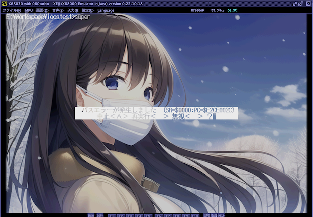
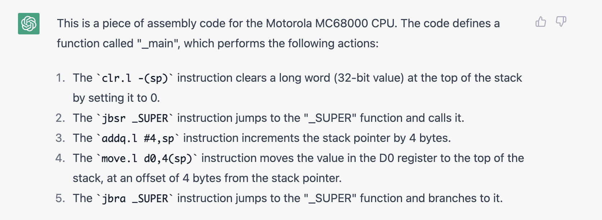
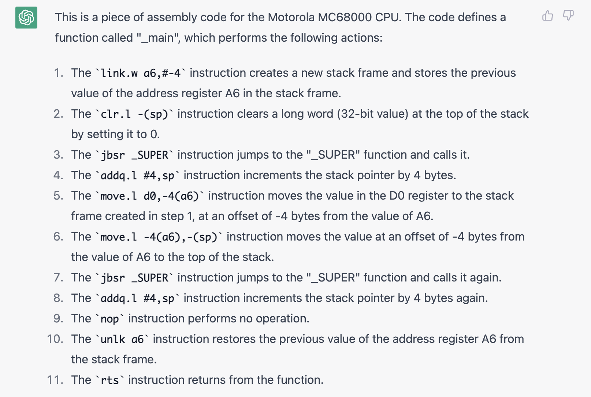

# X680x0 gcc で ユーザモード復帰時のバスエラー対策

### はじめに

X680x0 の最新の開発環境である xdev68k を使うと、gcc version 10~12 などの最新のコンパイラを使うことができます。
この時に既知の問題の一つとして、"SUPER()またはB_SUPER()でユーザモードに復帰する時にバスエラーが起こることがある" というものがあります。

---

### 問題の再現

以下のコードをコンパイルしてみます。コンパイルオプションは xdev68k 付属のデフォルト、SUPER()はDOSコール、B_SUPER()はIOCSコールになります。

    #include <stdio.h>
    #include <doslib.h>
    #include <iocslib.h>

    void main(int argc, char* argv[]) {

        int ssp = SUPER(0); // もしくは B_SUPER(0);

        SUPER(ssp); // もしくは B_SUPER(ssp);
    }

実行してみると、バスエラーの白帯が出ます。ちなみに B_SUPER() にするとアドレスエラーになったりします。

---

### 簡単な対策

試しに最適化コンパイルオプションの `-Os` を外してみると、エラーが出なくなります。どうも最適化が悪さをしていることが分かります。

---

### アセンブラコードの比較

`-Os` ありでコンパイルされたアセンブラコード(抜粋)は次の通り

    _main:
	    clr.l -(sp)
	    jbsr _SUPER
	    addq.l #4,sp
	    move.l d0,4(sp)
	    jbra _SUPER

最適化オプションなしでコンパイルされたアセンブラコードは次の通り

    _main:
	    link.w a6,#-4
	    clr.l -(sp)
	    jbsr _SUPER
	    addq.l #4,sp
	    move.l d0,-4(a6)
	    move.l -4(a6),-(sp)
	    jbsr _SUPER
	    addq.l #4,sp
	    nop
	    unlk a6	
	    rts

それぞれ似たようなコードですが、せっかくなので AIチャットボットの [ChatGPT](https://openai.com/blog/chatgpt/) に解説してもらいます。

これによると、最適化オプションをつけない場合は保護のためにa6レジスタを使って新しいスタックフレームを作った上でSUPER()の呼び出しを行なっています。

さらに X68000 側で gcc -S -O でコンパイルした場合のアセンブラコードを見ると、最適化オプションをつけたにも関わらず、a6レジスタでスタックフレームが作られています。

    _main:
            link a6,#0
            move.l a3,-(sp)
            pea 0.w
            lea _SUPER,a3
            jbsr (a3)
            move.l d0,-(sp)
            jbsr (a3)
            move.l -4(a6),a3
            unlk a6
            rts

