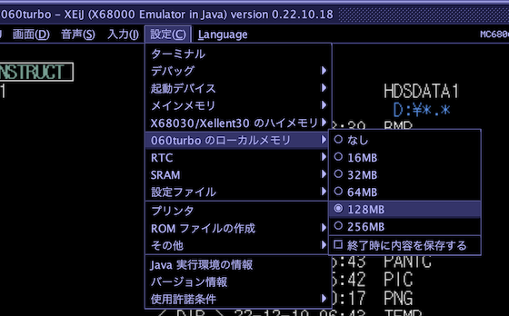

# X680x0 C言語でハイメモリを使う方法

2022.12 tantan

---

### はじめに

この覚書は、X680x0でハイメモリ(ローカルメモリ)を使ったソフトウェアをC言語で開発するためのものです。

自分が現役でX68000の実機を触っていた頃は、Xellent30という68030MPU搭載のアクセラレータボード上にわずかながらSRAMが載っており、
これをMMUありのMC68030に差し替えてメインメモリにマッピングしてアプリケーションを高速化して遊んでいた覚えがあります。

X680x0関連のハードウェアはその後も多くの種類がリリースされ、16MB~128MBものハイメモリを搭載するハードウェアが増えました。
発端となったのはツクモの拡張ボードだったようで、そこで採用されたIOCSコールの独自拡張が、その他のハイメモリ搭載ハードウェアでも互換で使えたようです。

---

### 準備

準備としてやることは2つです。

* ハイメモリ対応ハードウェアの導入、もしくはエミュレータの設定
* ハイメモリ対応のドライバをCONFIG.SYSに追加

例えばエミュレータXEiJであれば、MPUメニューから機種で060turboを選択し、設定メニューから060turboのハイメモリ容量を設定します。
その上でデバイスドライバ 060turbo.sys をCONFIG.SYSに追加する必要があります。

他の実機やエミュレータについてはそれぞれのドキュメントを参照してください。

---

### C言語からの利用

C言語でメモリをまとめて確保したい場合、使うのは標準ライブラリにある `malloc()` と `free()` です。ハイメモリを使う場合の基本的な考え方は、これらの2つの関数を拡張されたIOCSコールで置き換えてやることです。ここでは `malloc_himem()` と `free_himem()` という2つの関数を自作することを目標にします。

---

### インクルードファイル

インクルードする必要があるのは `iocslib.h` だけです。

    #include <iocslib.h>
    
IOCSコールを使うことになるのでXCのライブラリが必要になります。

---

### 拡張されたIOCSコールの呼び出し

使う必要があるのはメモリ確保の場合も解放の場合も、`TRAP15(struct REGS* inregs, struct REGS* outregs)` というライブラリ関数だけです。

`struct REGS` という構造体は `iocslib.h` の中で定義されており、MPUのレジスタとの値の受け渡しを、レジスタ名を指定して行うことができます。

---

### ハイメモリ確保の場合

下がハイメモリからメモリ確保を行う `malloc_himem()` を実装してみたものです。`stddef.h` を追加でインクルードしているのは、`size_t`型を使うためです。必須ではないのですが、長さや数を表す場合は `int` や `unsigned int` をそのまま使うよりも、可読性が良くなるのでこちらの方が推奨されます。

    #include <stddef.h>
    #include <iocslib.h>

    void* malloc_himem(size_t size) {

        struct REGS inRegs = { 0 };     // zero fill
        struct REGS outRegs = { 0 };    // zero fill

        inRegs.d0 = 0xF8;               // 0xF8 = IOCS _HIMEM
        inRegs.d1 = 1;                  // HIMEM_MALLOC
        inRegs.d2 = size;

        TRAP15(&inRegs, &outRegs);

        return (outRegs.d0 == 0) ? (void*)out_regs.a1 : NULL;
    }

IOCSコールの呼び出しでTRAP15()を使う前に、まずは REGS構造体の変数を2つ初期化しておきます。さらに入力側には IOCSコール番号である0xF8をd0に、HIMEM_MALLOCのファンクション番号である1をd1に、確保するバイト数をd2に入れます。戻り値としてd0に成功がどうかが入るので、それをみて確保されたアドレス(a1)または
