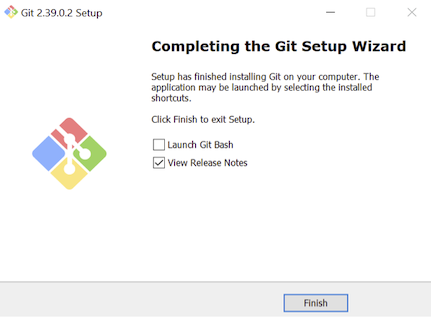

# X680x0 / Windows ユーザ向けの Python 活用ガイド

2022.12 tantan

---

### はじめに

Python は2022年現在最もポピュラーなプログラミング言語の一つです。テキストやデータの簡単な処理からAI・機械学習・ディープラーニングに至るまで、幅広く使われています。
言語の文法自体は他のスクリプト言語(Ruby,Perlなど)と大して変わらないのですが、ユーザが桁違いに多いために世界中の人が作ったライブラリがとても充実しており、
何かやりたいと思った時にまずはライブラリを探すことから始まるといっても良いくらいです。

そんなPythonはLinuxやmacOSでは元々OSのセットアップに含まれていることが多く、すぐに使える状態になっていることがほとんどです。
しかし残念ながらWindowsでは自分でセットアップが必要です。

このガイドはWindowsでPythonをセットアップしてみよう、そしてできればX680x0環境の充実のためにそれを活用してみよう、と思っている方のために書きました。

---

### Python のインストール

Python は Linux などと同様に、「ディストリビューション」という形でライブラリ込みの形で配布されている場合がありますが、ここでは公式サイトから素のPythonを導入することにします。

公式サイトは以下になります。

・[https://python.org/](https://python.org/)

公式サイトから Windows 用の Python 3.x 最新版のインストーラをダウンロードします。

インストーラが起動したら、"Add python.exe to PATH" にチェックを入れてから、Install Now を押して進みます。
(手元のWindowsが英語版なので英語表記になっていますが、日本語版などもしかしたら日本語になっているかもしれません。適宜読み替えてください。)

インストールの最後で、"Disable path length limit" のボタンを押して、PATH環境変数の長さ制限を無効化します。

インストーラが終了したら、Power Shell もしくはコマンドウィンドウを開いて、以下のコマンドを打ってみます。ハイフンは2つです。

    python --version

下のようにバージョンが表示されればインストール成功です。

---

### Git のインストール

次に Windows 用の Git を導入します。Git も Python 同様にとても広く使われています。これはプログラミング言語ではなく、プログラムされたコードの変更管理のためのものです。
そもそもこのドキュメント自体は GitHub と呼ばれる Git をベースにしたエンジニア向けのサイト上で書かれています。

今回 Python だけを使うならば Git は必ずしも導入する必要は無いのですが、ここで自分が作成し配布している X680x0用データを扱う Python ライブラリを導入するために必要になります。
また、それ以外の GitHub 上の無数のプロジェクトから、自分が必要とするものを取り出したり、自分で GitHub にアカウントを作って自分のリポジトリを作ったりする時にもあると便利です。

公式サイトは以下になります。インストーラをダウンロードします。

・[https://gitforwindows.org/](https://gitforwindows.org/)

あれこれ聞かれますが、"エディタとして標準の Notepad を使う" を選択しておくくらいで、あとはデフォルトのままで大丈夫です。

インストールが完了したら、念のため一度 Windows を再起動しておきます。

再起動後、再び Power Shell かコマンドウィンドウを開いて、バージョンを確認します。

    python --version
    git --version

で以下のようにバージョンが表示されればokです。

---

### Python 追加パッケージのインストール

現在このサイトでは X680x0　絡みの自作 Python アプリケーションをパッケージの形にして配布しています。

・[pymag](https://github.com/tantanGH/pymag/) ... Python MAG画像 エンコーダ
・[dim2xdf](https://github.com/tantanGH/dim2xdf/) ... Python DIM ディスクイメージ to XDF ディスクイメージ コンバータ
・[wav2adpcm](https://github.com/tantanGH/wav2adpcm/) ... Python WAVE データ to X68k ADPCM データ コンバータ

ここでは試しにこれらを入れてみます。

Power Shell で以下のコマンドを入力します。

    pip install git+https://github.com/tantanGH/pymag.git
    pip install git+https://github.com/tantanGH/dim2xdf.git   
    pip install git+https://github.com/tantanGH/wav2adpcm.git

コマンド `pip` は Python標準のパッケージ管理ツールです。好きなパッケージ(ライブラリ)を入れたり外したりを安全かつ簡単に行うことができます。

3つのコマンドの実行が終わったら、以下のコマンドで導入されたパッケージとバージョンを確認してみます。

    pip list

上のように pymag, dim2xdf, wav2adpcm がリストに入っていれば導入成功です。

今導入した3つのパッケージは実行可能アプリケーションとしても構成されていますので、以下のコマンドが Power Shell内で使えるようになっているはずです。

    pymag
    dim2xdf
    wav2adpcm
    
それぞれ引数なしで実行してみて、ヘルプメッセージが表示されれば正しくインストールされています。

ただし、最後の `wav2adpcm` だけはやや特殊な機種依存のライブラリに依存しているため、警告がでます。
実際の使用には問題ないので無視して良いのですが、気になる場合は以下のファイルを手で書き換えることによってこの警告を消すことができます。

　　　　C:\Users\ユーザ名\AppData\Local\Programs\Python\Python311\Scripts\wav2adpcm-script.py
    
メモ帳で最初の1行に ` -W ignore` を加えて保存します。

これで警告が消えました。

---

### Python サンプルの利用 (pymag)

X680x0 は　768x512 の画面モードを使った場合、残念ながら16色パレットのグラフィック画像しか画面全体に表示することができません。
搭載されているGVRAMの容量が512KBしか無いため、65536色モードだと最大解像度が512x512ドットになってしまうからです。

このコンバータ `pymag` は、既存の画像を X680x0 の 768x512 で表示可能なように、リサイズと減色を行なった上で　MAG形式で保存するものです。
MAG形式は1990年代にパソコン通信で広く使われていた画像フォーマットの一つで、16色もしくは256色の可逆圧縮画像を扱うことができます。
X680x0にも多くの種類の画像ローダが存在しています。

ためしに縦横比3:2のjpeg画像を拾ってきて(3:2でなかったら必要に応じてトリミングしておいて)、このコンバータにかけて MAG画像ファイルを生成します。
元画像はjpegでもpngでもBMPでも構いません。ただし透過pngの場合は `-q 2` をつける必要があるかもしれません。

できあがったMAGファイルを実機もしくはエミュに持っていって表示します。

    
