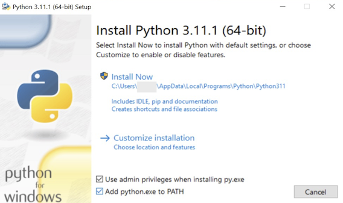

# X680x0 / Windows ユーザ向けの Python 活用ガイド

2022.12 tantan

---

### はじめに

Python は2022年現在最もポピュラーなプログラミング言語の一つです。テキストやデータの簡単な処理からAI・機械学習・ディープラーニングに至るまで、幅広く使われています。
言語の文法自体は他のスクリプト言語(Ruby,Perlなど)と大して変わらないのですが、ユーザが桁違いに多いために世界中の人が作ったライブラリがとても充実しており、
何かやりたいと思った時にまずはライブラリを探すことから始まるといっても良いくらいです。

そんなPythonはLinuxやmacOSでは元々OSのセットアップに含まれていることが多く、すぐに使える状態になっていることがほとんどです。
しかし残念ながらWindowsでは自分でセットアップが必要です。

このガイドはWindowsでPythonをセットアップしてみよう、そしてできればX680x0環境の充実のためにそれを活用してみよう、と思っている方のために書きました。

---

### Python のインストール

Python は Linux などと同様に、「ディストリビューション」という形でライブラリ込みの形で配布されている場合がありますが、ここでは公式サイトから素のPythonを導入することにします。

公式サイトは以下になります。

・[https://python.org/](https://python.org/)

公式サイトから Windows 用の Python 3.x 最新版のインストーラをダウンロードします。

インストーラが起動したら、"Add python.exe to PATH" にチェックを入れてから、Install Now を押して進みます。
(手元のWindowsが英語版なので英語表記になっていますが、日本語版などもしかしたら日本語になっているかもしれません。適宜読み替えてください。)

インストールの最後で、"Disable path length limit" のボタンを押して、PATH環境変数の長さ制限を無効化します。

インストーラが終了したら、Power Shell もしくはコマンドウィンドウを開いて、`python --version` と打ってみましょう。
下のようにバージョンが表示されればインストール成功です。

