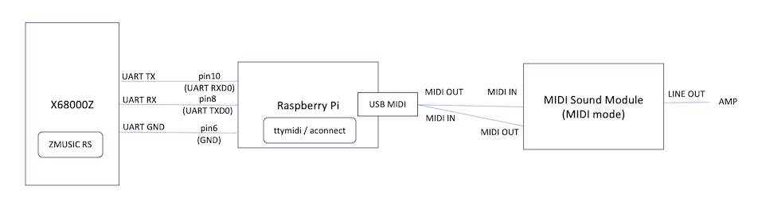
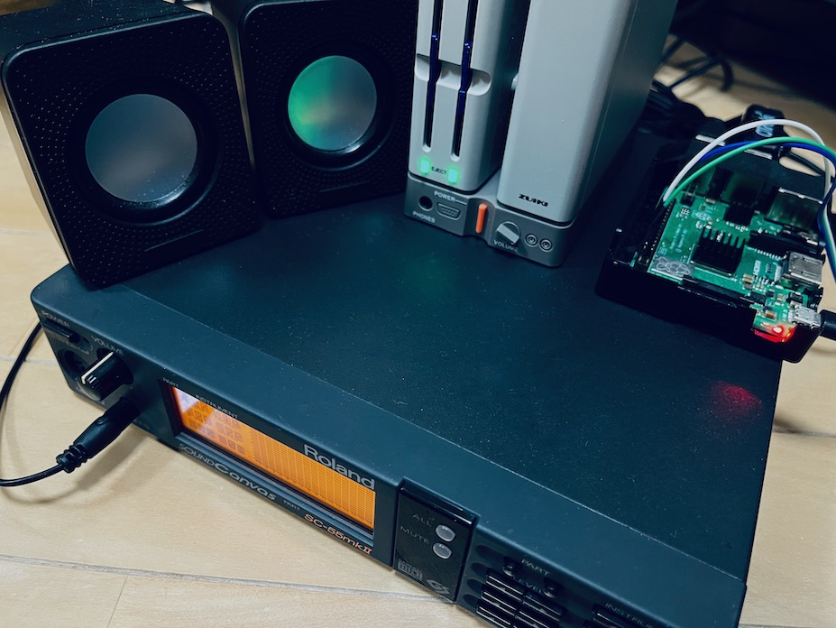

## X68000Z と Raspberry Pi 3B+/4B で RS-MIDI再生を行う構成例

注意：内容については全くの無保証です。X68000Z, Raspberry Pi, MIDI機器などに致命的な損傷が出ても対応できませんので、試す場合は自己責任でお願いします。

Apr.2023 tantan

---

### 用意するもの

- X68000Z 本体
- X68000Z 本体付属のUARTケーブル
- ブレッドボード用ジャンパケーブル(オス-メス) 3本 (無くても良いが、純正UARTケーブルの延長と抜き差し回数を減らす意味合い)
- Raspberry Pi 3B+ または 4B (それ以外の機種は持ってないので不明)
- USB-MIDI アダプタ
- MIDI音源(SC55mkIIでのみ確認)

---

### Raspberry Pi のセットアップ

以下すべて OS は 32bit Lite (デスクトップ無し) の2023年4月時点の最新のもので確認した手順。

#### シリアルコンソール無効化とUART有効化

        sudo raspi-config

  Interface Options, Serial Port を選択して serial console -> no, uart -> yes を選択し、raspi-configを終了する。再起動。

        sudo reboot

#### Bluetooth 無効化

        sudo vi /boot/config.txt

  以下追加して再起動

        dtoverlay=disable-bt

#### Primary UART確認

        ls -alF /dev/serial*

  `/dev/serial0` が `ttyAMA0` へのシンボリックリンクになっていることを確認

#### ttymidiのインストール

        sudo apt-get install libasound2-dev
        wget http://www.varal.org/ttymidi/ttymidi.tar.gz
        tar zxvf ttymidi.tar.gz
        cd ttymidi/

  Makefile編集
        
        vi Makefile

  `-O2` `-lpthread`を追加する

        gcc src/ttymidi.c -O2 -o ttymidi -lasound -lpthread

  ビルド＆インストール。makeの警告は無視でok

        make 
        sudo make install

---

### X68000Z のセットアップ

#### Emulator Settings

電源投入後すぐに interrupt ボタンを押し、Setup utility を起動する。
RS232 ボーレートを 19200bps に設定する。

なお、ZMUSICが直接RS232Cを制御するため、Human68k上での SWITCH.X や SPEED.X による RS232C 設定は不要。

#### 起動XDFの準備

- Human68k 3.02
- CONFIG.SYS の RSDRV.SYS をコメントアウト
- ZMUSIC.X 2.08 の RS-MIDI パッチ版
- MZP一式
- いくつかのMIDIサンプル曲(ZMS/RCP等)

上記のうち、サンプル曲を除いて構成した起動XDFの例

- [X68Z_ZMUSICRS_20230406.XDF](https://github.com/tantanGH/distribution/raw/main/x68000z/xdf/X68Z_ZMUSICRS_20230406.XDF)

なお、SHARPより無償公開された HUMAN302.XDF をベースにメモリの半分をディスクキャッシュとRAMDISKに割り当てた上、以下のフリーソフトと一部自作のツールを組み込んでカスタマイズしてあります。作者の皆様にお礼申し上げます。

- [hiocs16.lzh](https://github.com/tantanGH/distribution/raw/main/x68000z/archives/hiocs16.lzh) ... 高速IOCSドライバ HIOCS.X (yunkさん)
- [LXR120FS.LZH](https://github.com/tantanGH/distribution/raw/main/x68000z/archives/LXR120FS.LZH) ... 高速LHA展開ツール LX.r (M.Harashinoさん)
- [LZX104.LZH](https://github.com/tantanGH/distribution/raw/main/x68000z/archives/LZX104.LZH) ... 実行ファイル圧縮ツール LZX.X (F&I さん, 板垣史彦さん)
- [MMDSP030.zip](https://github.com/tantanGH/distribution/raw/main/x68000z/archives/MMDSP030.zip) ... リアルタイムディスプレイミュージックセレクタ MMDSP.r (Ｇａｏさん, 三上 響さん)
- [MZP113.LZH](https://github.com/tantanGH/distribution/raw/main/x68000z/archives/MZP113.LZH) ... マルチミュージックプレーヤ for ZMUSIC MZP.X (NOVAさん)
- [pcm8a102.lzh](https://github.com/tantanGH/distribution/raw/main/x68000z/archives/pcm8a102.lzh) ... ポリフォニックPCMドライバ PCM8A.X (phillyさん)
- [tw136c14.lzh](https://github.com/tantanGH/distribution/raw/main/x68000z/archives/tw136c14.lzh) ... 21文字ファイル名対応ドライバ TwentyOne.x (Extさん, GORRYさん)
- [ZM208.LZH](https://github.com/tantanGH/distribution/raw/main/x68000z/archives/ZM208.LZH) ... ZMUSIC v2 システム (Z.Nishikawaさん)

---

### ハードウェア接続

#### すべての電源OFF

X68000Z、Raspberry Pi、MIDI音源のすべての電源を切る。Raspberry Piは電源ケーブルを抜いておく。

#### UART結線

- X68000Z UART GND - (ジャンパケーブル) - Raspberry Pi 6番ピン(GND)
- X68000Z UART RX  - (ジャンパケーブル) - Raspberry Pi 8番ピン(GPIO14, UART_TXD0)
- X68000Z UART TX  - (ジャンパケーブル) - Raspberry Pi 10番ピン(GPIO15, UART_RXD0)

X68000Z の UART 配線色は付属の説明書参照

6番ピンのすぐ隣の4番ピンは+5Vなので、間違うと短絡して両方破損する可能性が高い。入念に確認する。

#### MIDI結線

USB-MIDIアダプタを Raspberry Piに接続。

- USB-MIDI アダプタ MIDI OUT - MIDI音源 MIDI IN
- USB-MIDI アダプタ MIDI IN - MIDI音源 MIDI OUT

MIDI音源側にserial(PC)/MIDIモードの切り替えがあれば、MIDIモードにしておく。

#### 電源ON

電源を入れ、煙や匂いが無いことを確認ww

---

### RS-MIDI再生

#### ttymidi 開始

Raspberry Pi にログインし、ttymidi を Primary UARTを使ってバックグラウンドで開始する。

        ttymidi -s /dev/serial0 -b 38400 &

#### aconnect

現在の認識状況を確認し、ttymidi の out を USB MIDI の in に繋げる。

        $ aconnect -io
        client 0: 'System' [type=kernel]
            0 'Timer           '
            1 'Announce        '
        client 14: 'Midi Through' [type=kernel]
            0 'Midi Through Port-0'
        client 28: 'USB MIDI Interface' [type=kernel,card=3]
            0 'USB MIDI Interface MIDI 1'
        client 128: 'ttymidi' [type=user,pid=971]
            0 'MIDI out        '
            1 'MIDI in         '

        $ aconnect 128:0 28:0

#### Human起動

エミュレータモードでHuman68kを起動し、ZMUSICv2 RS-MIDI を常駐させる。

#### 曲の再生

任意のMIDIデータを ZMUSICで再生できる `MZP.X` がとても便利。

        mzp hogehoge.zms
        mzp mogemoge.rcp

個別に再生するならば、

- ZMSであれば `ZP.X` や `MMDSP.r`
- RCPであれば `RCtoZ.X`

など。

---

### 制限事項

- ttymidi で Unknown CMD が表示される (通信の問題っぽい。未解決)
- MMDSPの表示とタイミングがズレる (workaround: USB-MIDIではなくRaspberry Pi内で FluidSynthなどのソフトシンセを使う)

---

### 変更履歴

- 2023/04/06 ... 起動用XDFサンプルイメージ追加 その他小修正
- 2023/04/05 ... 初版