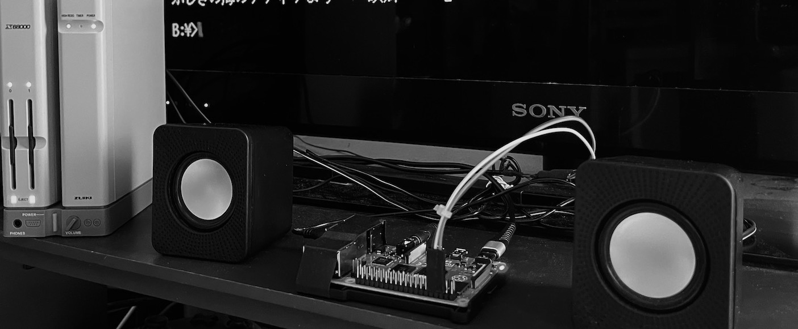
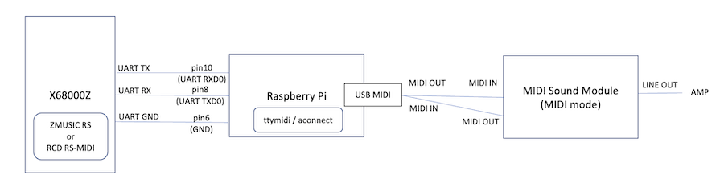
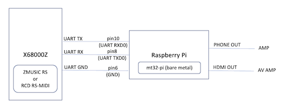

## X68000Z と Raspberry Pi 3B+/4B で RS-MIDI再生を行う構成例

注意：内容については全くの無保証です。X68000Z, Raspberry Pi, MIDI機器などに致命的な損傷が出ても対応できませんので、試す場合は自己責任でお願いします。

Apr.2023 tantan

 

---

### 構成パターン

この覚書は以下の2つの構成パターンについて記述してあります。

1. X68000Z + Raspberry Pi + USB-MIDIアダプタ + MIDI音源実機

 

2. X68000Z + Raspberry Pi + ベアメタル上のソフト音源 (mt32-pi)

 

それぞれのPros/Consは

Pros:
1. MIDI音源実機を鳴らすロマン。
2. MIDI音源無しですぐ始められる。使えるレベルのGS音源再現性。

Cons:
1. 取りこぼしややあり。遅延目立つ。
2. ラズパイが1つ占有される。ちょっとノイジー。

という感じです。ラズパイOS上でソフト音源のFluidSynthを鳴らす構成も試しましたが、取りこぼしが大きくあまり実用的ではありませんでした。

---

### 用意するもの

- X68000Z 本体
- X68000Z 本体付属のUARTケーブル
- ブレッドボード用ジャンパケーブル(オス-メス) 3本 (無くても良いが、純正UARTケーブルの延長と抜き差し回数を減らす意味合い)
- Raspberry Pi 3B+ または 4B (それ以外の機種は持ってないので不明)

構成パターン1(外部MIDI音源)の場合は追加で以下も必要
- USB-MIDI アダプタ
- MIDI音源(Roland SC55mkII実機でのみ確認)

---

### Raspberry Pi のセットアップ (構成パターン1 MIDI外部音源の場合)

以下 OS は 32bit Lite (デスクトップ無し) の2023年4月時点の最新のもので確認した手順。

X68000Z - Raspberry Pi 間でハードウェアフロー制御無しの UART 38400bps での通信は安定性を欠くため、余計な物を一切動かさないことをお勧めします。
デスクトップありのOSバージョンはお勧めしません。

#### シリアルコンソール無効化とUART有効化

        sudo raspi-config

  Interface Options, Serial Port を選択して serial console -> no, uart -> yes を選択し、raspi-configを終了する。再起動。

        sudo reboot

#### Bluetooth 無効化

        sudo vi /boot/config.txt

  以下追加して再起動

        dtoverlay=disable-bt

#### Primary UART確認

        ls -alF /dev/serial*

  `/dev/serial0` が `ttyAMA0` へのシンボリックリンクになっていることを確認

#### ttymidiのインストール

        sudo apt-get install libasound2-dev
        wget http://www.varal.org/ttymidi/ttymidi.tar.gz
        tar zxvf ttymidi.tar.gz
        cd ttymidi/

  Makefile編集
        
        vi Makefile

  `-O2` `-lpthread`を追加する

        gcc src/ttymidi.c -O2 -o ttymidi -lasound -lpthread

  ビルド＆インストール。makeの警告は無視でok

        make 
        sudo make install

---

### Raspberry Pi のセットアップ (構成パターン2 ベアメタルmt32-piの場合)

#### SDカードの準備

32GB以下のMicroSDカードをFAT32でフォーマットする。

#### MT32-piのファイルをコピーする

[mt32-pi](https://github.com/dwhinham/mt32-pi/releases) のサイトから、最新のパッケージをダウンロードし、SDカードのルートに展開する。

#### 設定ファイル更新

ルートにある mt32-pi.cfg を編集する。以下は変更すべき箇所の例

パラメータ|変更前|変更後
-|-|-
default_synth|mt32|soundfont
usb|on|off
gpio_baud_rate|31250|38400
output_device|pwm|もしHDMIから音声出力したいならhdmi

#### SDカードの差し替え

ラズパイにSDカードを入れる。ベアメタル動作となるのでラズパイは占有され、他のことはできないので注意。

---

### X68000Z のセットアップ

#### Emulator Settings

電源投入後すぐに interrupt ボタンを押し、Setup utility を起動する。
RS232 ボーレートを 19200bps に設定する。

なお、ZMUSICが直接RS232Cを制御して38400bpsの通信を行うため、Human68k上での SWITCH.X や SPEED.X による RS232C 設定は不要。

上記Emulator Settingsについては下のレイヤで余計なウェイトなどが入らないことを期待してのおまじない程度の意味。

#### 起動XDFの準備

- Human68k 3.02
- CONFIG.SYS の RSDRV.SYS をコメントアウト
- ZMUSIC.X 2.08 の RS-MIDI パッチ版
- RCD.X 3.01q の RS-MIDI X68000Z対応パッチ版
- MZP一式
- いくつかのMIDIサンプル曲(ZMS/RCP等)

上記のうち、サンプル曲を除いて構成した起動XDFの例

- [X68Z_RSMIDI_20230418.XDF](https://github.com/tantanGH/distribution/raw/main/x68000z/xdf/X68Z_RSMIDI_20230418.XDF)

なお、SHARPより無償公開された HUMAN302.XDF をベースにメモリの半分をディスクキャッシュとRAMDISKに割り当てた上、以下のフリーソフトと一部自作のツールを組み込んでカスタマイズしてあります。作者の皆様にお礼申し上げます。

- [hiocs16.lzh](https://github.com/tantanGH/distribution/raw/main/x68000z/archives/hiocs16.lzh) ... 高速IOCSドライバ HIOCS.X (yunkさん)
- [LXR120FS.LZH](https://github.com/tantanGH/distribution/raw/main/x68000z/archives/LXR120FS.LZH) ... 高速LHA展開ツール LX.r (M.Harashinoさん)
- [LZX104.LZH](https://github.com/tantanGH/distribution/raw/main/x68000z/archives/LZX104.LZH) ... 実行ファイル圧縮ツール LZX.X (F&I さん, 板垣史彦さん)
- [MMDSP030.zip](https://github.com/tantanGH/distribution/raw/main/x68000z/archives/MMDSP030.zip) ... リアルタイムディスプレイミュージックセレクタ MMDSP.r (Ｇａｏさん, 三上 響さん)
- [MZP113.LZH](https://github.com/tantanGH/distribution/raw/main/x68000z/archives/MZP113.LZH) ... マルチミュージックプレーヤ for ZMUSIC MZP.X (NOVAさん)
- [pcm8a102.lzh](https://github.com/tantanGH/distribution/raw/main/x68000z/archives/pcm8a102.lzh) ... ポリフォニックPCMドライバ PCM8A.X (phillyさん)
- [tw136c14.lzh](https://github.com/tantanGH/distribution/raw/main/x68000z/archives/tw136c14.lzh) ... 21文字ファイル名対応ドライバ TwentyOne.x (Extさん, GORRYさん)
- [ZM208.LZH](https://github.com/tantanGH/distribution/raw/main/x68000z/archives/ZM208.LZH) ... ZMUSIC v2 システム (Z.Nishikawaさん)

RCD.X については、そのままでは X68000Z EAK 1.1.3 では動作しなかったので独自に対策を施したパッチを当てたものを入れています。ただし、正常な動作を保証するものではありません。また、今後のZエミュレータの更新により動かなくなる、不要になるケースも想定されます。また、このパッチを当てたバージョンは実機では正常に動作しません。

- [rc3013.Lzh](https://github.com/tantanGH/distribution/raw/main/x68000z/archives/rc3013.Lzh) ... RCD システム 3.01q (HARPOONさん, TURBOさん)
- [conv3013.Lzh](https://github.com/tantanGH/distribution/raw/main/x68000z/archives/conv3013.Lzh) ... RCD システム 3.01用各種MIDIフォーマットコンバータ (HARPOONさん, TURBOさん)
- [rcd301q1.zip](https://github.com/tantanGH/distribution/raw/main/x68000z/archives/rcd301q1.zip) ... RCD.X 3.01q RS-MIDIモードを X68000Z UART で動作させるパッチ (tantan)

---

### ハードウェア接続 

#### すべての電源OFF

X68000Z、Raspberry Pi、MIDI音源のすべての電源を切る。Raspberry Piは電源ケーブルを抜いておく。

#### UART結線

- X68000Z UART GND - (ジャンパケーブル) - Raspberry Pi 6番ピン(GND)
- X68000Z UART RX  - (ジャンパケーブル) - Raspberry Pi 8番ピン(GPIO14, UART_TXD0)
- X68000Z UART TX  - (ジャンパケーブル) - Raspberry Pi 10番ピン(GPIO15, UART_RXD0)

X68000Z の UART 配線色は付属の説明書参照

6番ピンのすぐ隣の4番ピンは+5Vなので、間違うと短絡して両方破損する可能性が高い。入念に確認する。

#### MIDI結線 (構成1.外部MIDI音源の場合)

USB-MIDIアダプタを Raspberry Piに接続。

- USB-MIDI アダプタ MIDI OUT - MIDI音源 MIDI IN
- USB-MIDI アダプタ MIDI IN - MIDI音源 MIDI OUT

MIDI音源側にserial(PC)/MIDIモードの切り替えがあれば、MIDIモードにしておく。

#### 電源ON

電源を入れ、煙や匂いが無いことを確認ww

---

### RS-MIDI再生準備 (構成パターン1 MIDI外部音源の場合)

#### ttymidi 開始

Raspberry Pi にログインし、ttymidi を Primary UARTを使ってバックグラウンドで開始する。

        ttymidi -s /dev/serial0 -b 38400 &

#### aconnect

現在の認識状況を確認し、ttymidi の out を USB MIDI の in に繋げる。

        $ aconnect -io
        client 0: 'System' [type=kernel]
            0 'Timer           '
            1 'Announce        '
        client 14: 'Midi Through' [type=kernel]
            0 'Midi Through Port-0'
        client 28: 'USB MIDI Interface' [type=kernel,card=3]
            0 'USB MIDI Interface MIDI 1'
        client 128: 'ttymidi' [type=user,pid=971]
            0 'MIDI out        '
            1 'MIDI in         '

        $ aconnect 128:0 28:0

---

### RS-MIDI再生準備 (構成パターン2 ベアメタルmt32-piの場合)

ラズパイ電源ONでmt32-piが起動するので、特になし

---

### RS-MIDI再生 (X68000Z)

#### Human起動

エミュレータモードでHuman68kを起動し、ZMUSICv2 RS-MIDI またはパッチ済み RCD.X RS-MIDIモード(-c) を常駐させる。

#### 曲の再生 (ZMUSIC)

任意のMIDIデータを ZMUSICで再生できる `MZP.X` が便利。

        mzp hogehoge.zms
        mzp mogemoge.rcp

個別に再生するならば、

- ZMSであれば `ZP.X` や `MMDSP.r`
- RCPであれば `RCtoZ.X`

など。再生の停止は、

        mzp -s

#### 曲の再生 (RCD)

        rcp mogemoge.rcp
        itor -b paepae.mid

など。`MMDSP.r` も利用可能。再生の停止は、

        rcp -e

歌詞データファイル .WRD が存在する場合は、WRDP.X を使って

        wrdp mogemoge.rcp

とRCPファイルを指定すると(WRDファイルではない)、歌詞付きでの演奏が可能。

---

### Known Issues

構成1:
- ttymidi で Unknown CMD が表示される (38400bps通信の不安定さから)
- 遅延によりMMDSPの表示とタイミングがズレる

構成2:
- ヘッドフォンジャックからの音声出力がノイジー

---

### 変更履歴

- 2023/04/18 ... RCD.X 3.01 X68000Z 独自パッチ版を追加
- 2023/04/16 ... mt32-pi接続を追加
- 2023/04/10 ... bpsに関する追記
- 2023/04/06 ... 起動用XDFサンプルイメージ追加 その他小修正
- 2023/04/05 ... 初版