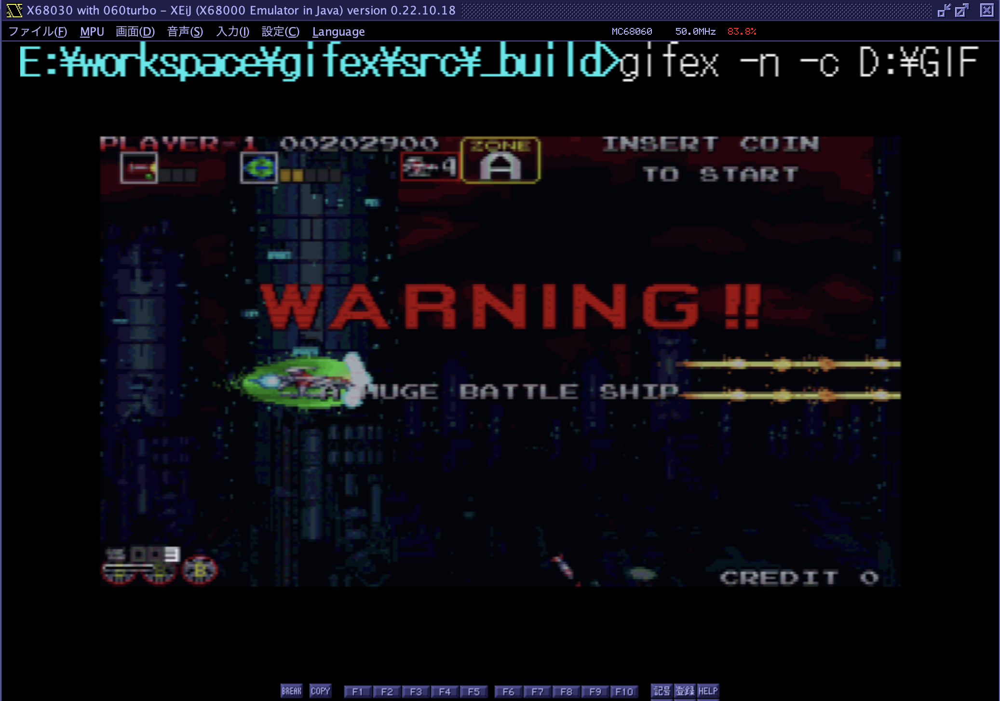

# X680x0 で 384x256 の画面モードを使う

2023.1 tantan

---

### はじめに

X680x0 では 256x256 や 512x512 といった画面モードで、マシン本来の豊富なグラフィックスやスプライト、重ね合わせなどの機能が活用できるように設計されています。
本来であればそれらのモードを使用したソフトウェアを開発するのが本流だと思われます。

しかしながらこれらのモードを使いにくくしている理由の一つがピクセルのアスペクト比になります。
4:3の画面全体を縦横それぞれ同じ数のピクセルで均等割りしているのですから、1ピクセルはどうしても横長になってしまいます。

現代においては様々なグラフィックス素材は1:1の正方形ピクセルを前提とされたものがほとんどです。
外から何らかの素材を持ち込む時には、X680x0側も正方形ピクセルの画面モードにした方が変換の手間や質の面でメリットがあると言えます。

そうした正方形ピクセルを使えるのが768x512であり、384x256の画面モードになります。

注) 画面の大きさが4:3なのにピクセルの数が3:2になっているのはブラウン管の場合上下が多少切れるのが普通だったからです。
なので厳密には正方形ではありません。

---

### 384x256 モード

このモードは使える色数、画面数、データ量、等々バランスが良く、特にゲームでの利用に向いています。
ただ、正式にサポートされたものではないので、IOCSコールなどで簡単に設定するということはできません。

内部的には512x256の画面モードを利用しつつ、CRTCレジスタを直接操作して横を広げて384x256に相当する部分だけを表示する、というのが実際の方法になります。
ここではこのモードの設定方法について概略だけを覚書として残しておきます。

概略に留めるのは実機も無いので内容の正しさを検証できないですし、最悪本体故障の原因ともなりかねないからです。

---

### 参考資料

参考資料とすべきなのは以下の2つです。

* Inside X68000 (桒野雅彦, 1992年, ソフトバンク)
* Inside/Out X6830 (桒野雅彦, 1994年, ソフトバンク)

X680x0 のバイブルとも言える2冊 (実際にはこれに加えてOutside X68000もあります)、これらのレジスタの設定方法の詳細が細かく記載されています。
自分も現役で実機を触っていた頃からお世話になったものです。Outside X68000を見て赤外線リモコンを電子工作したりもした覚えがあります。

---

### 具体的な設定手順

参考資料を見てくださいでは覚書にならないので、384x256(65536色, 31kHz) というモードに特化した設定例を参考として記載しておきます。
操作する必要のあるレジスタは以下の通りです。

* CRTC R00
* CRTC R01 - R08
* CRTC R20
* ビデオコントローラR1 
* ビデオコントローラR2
* GPIP
* システムポート
* スプライトコントローラ
* パレット

これらを以下の順で操作します。

1. スーパーバイザモードに入る
2. GPIPのV-DISPを見て垂直表示期間の開始 → 垂直帰線期間の開始を待つ
3. 現在の解像度がターゲットとなる384x256(65536色,31kHz,スプライト無し)と比べて高いか低いかを調べる
4. 現在の解像度が低い場合は R00 → R01~R08 → R20 の順でCRTCレジスタを設定する
5. 現在の解像度が高い場合は R20 → R01~R08 → R00 の順でCRTCレジスタを設定する
6. ビデオコントローラR1で画面モード(メモリモード)を設定する
7. システムポートのHRLビット(bit1)を立てる
8. ビデオコントローラR2で画面表示をONにする
9. スプライトコントローラを設定する
10. パレットを設定する

となります。

---

### CRTC レジスタへの設定値

こちらは Inside/Out X68030 に掲載されているパラメータになります。
ネットを検索すると違う設定のものもあったりますが(R00が偶数など)、この設定でエミュレータ上では表示できています。

|レジスタ|設定値|
|---|------|
|R00|0x0045|
|R01|0x0006|
|R02|0x000b|
|R03|0x003b|
|R04|0x0237|
|R05|0x0005|
|R06|0x0028|
|R07|0x0228|
|R08|0x001b|

